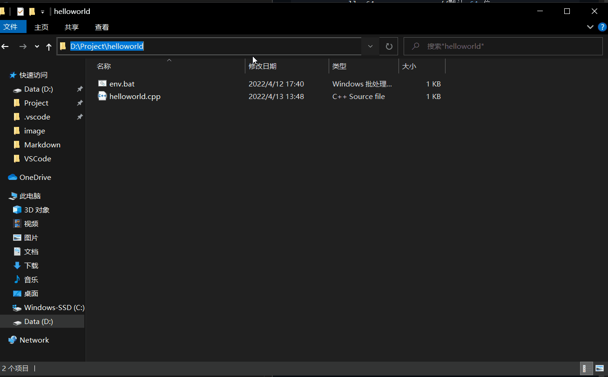

# 项目描述

* 在 win10 环境下搭建 ***MSVC 2019 C/C++*** 开发环境.
* 使用 VSCode 作为编辑器，完成对 C/C++ 程序的编译、执行、调试.
* 对 *c_cpp_properties.json* 、 *task.json* 、 *launch.json* 文件进行配置.
* MSVC 环境配置是一个复杂的过程，使用 .bat 文件完成这一操作，无需运行 ***developer command prompt for VS 2019*** 等应用初始化 ***MSVC 2019*** 环境.


# 参考博客
[VSCode 安装及常用扩展](https://zhuanlan.zhihu.com/p/87864677)

[MSVC 2019 运行环境初始化](https://zhuanlan.zhihu.com/p/369524929)

# 第一步：下载并安装 visual studio 2019

## 下载地址

https://docs.microsoft.com/zh-cn/visualstudio/releases/2019/release-notes

## 安装步骤

* 下载安装工具 ***visual studio installer***


* 选择安装组件 ***MSVC 2019***


* 等待安装完成
  
# 第二步：下载并安装 visual studio code

## 下载地址

https://code.visualstudio.com/

* 下载安装工具 ***visual studio code installer***


* 安装完成后进行自定义配置(主题、布局、字号等)

* 安装扩展

***其中 GitHub Copilot 需要 GitHub 账号登陆，并申请获得体验资格***


| Name                                  | Description                          |
| ------------------------------------  | ------------------------------------ |
| Chines(Simplified)                    | |
| C/C++                                 | |
| C/C++ Extension Pack                  | |
| GitHub Copilot                        | |
| [Deprecated] Bracket Pair Colorizer 2 | |

# 第三步：***helloworld*** 程序运行（未编写 .bat ）

* 参考博客
  https://blog.csdn.net/sinat_41752325/article/details/122474093

* 创建工程目录 ***D:\Project\helloworld***

* MSVC 初始化环境
>在搜索栏输入【developer】，找到如下，建议以管理员模式打开【Developer Command Prompt for VS 2019】（适用于VS2019的开发人员命令提示符）.


>32位环境为 x86 Native Tools Command Prompt for VS 2019


* 进入工程目录


* 使用 VSCode 打开该工程（此过程后，cmd 仍然不可以关闭）

>命令：code . // VSCode\bin 已添加到环境变量中

* 编写源文件 helloworld.cpp

``` C++
#include<iostream>
using namespace std;

int main()
{
    cout << "Hello World!" << endl;
    return 0;
}
```

* CTRL + SHIFT + B 编译


***编译成功***


* CTRL + F5 执行（非调试模式运行）


程序运行，且在当前路径下生成 ***\.vscode\tasks.json*** 
```json
{
    "tasks": [
        {
            "type": "cppbuild",
            "label": "C/C++: cl.exe 生成活动文件",
            "command": "cl.exe",
            "args": [
                "/Zi",
                "/EHsc",
                "/nologo",
                "/Fe:",
                "${fileDirname}\\${fileBasenameNoExtension}.exe",
                "${file}"
            ],
            "options": {
                "cwd": "${fileDirname}"
            },
            "problemMatcher": [
                "$msCompile"
            ],
            "group": {
                "kind": "build",
                "isDefault": true
            },
            "detail": "调试器生成的任务。"
        }
    ],
    "version": "2.0.0"
}
```

* F5 调试

与上一步一致.

* ***c_cpp_properties.json*** 文件配置（也可通过 CTRL + SHIFT + P 进行 UI 配置）
```json
{
    "configurations": [
        {
            "name": "Win32",
            "includePath": [
                "${workspaceFolder}/**"
            ],
            "defines": [
                "_DEBUG",
                "UNICODE",
                "_UNICODE"
            ],
            "windowsSdkVersion": "10.0.19041.0",
            "compilerPath": "C:/Program Files (x86)/Microsoft Visual Studio/2019/Community/VC/Tools/MSVC/14.29.30133/bin/Hostx64/x64/cl.exe",   //编译器路径
            "cStandard": "c17",
            "cppStandard": "c++17",
            "intelliSenseMode": "windows-msvc-x64"
        }
    ],
    "version": 4
}
```


* ***launch.json*** 文件配置

```json
{
    // 使用 IntelliSense 了解相关属性。 
    // 悬停以查看现有属性的描述。
    // 欲了解更多信息，请访问: https://go.microsoft.com/fwlink/?linkid=830387
    "version": "0.2.0",
    "configurations": [
        {
            "name": "(Windows) 启动",
            "type": "cppvsdbg",
            "request": "launch",
            "program": "${fileDirname}/${fileBasenameNoExtension}.exe",
            "args": [],//参数
            "stopAtEntry": false,//是否在程序main函数开始时停止
            "cwd":"${fileDirname}",
            "environment": [],
            "console": "externalTerminal",

            "preLaunchTask": "C/C++: cl.exe 生成活动文件"   //启动前执行的任务
        }

    ]
}
```

# 自动化进行编译环境初始化

***此过程，当 VSCode 打开工程后，cmd 可以退出.***

## 基本知识

1. 在D:\Program Files (x86)\Microsoft Visual Studio\2019\Enterprise\VC\Auxiliary\Build目录下，有vcvarsall.bat这个批处理脚本，脚本会调用D:\Program Files (x86)\Microsoft Visual Studio\2019\Enterprise\Common7\Tools\VsDevCmd.bat来设置msvc编译调试时所需要的环境变量，通过调用vcvarall.bat来配置编译环境即可.


2. 设置好编译环境后，此时编译器cl.exe、nmake.exe等所需程序都会临时添加到环境变量中，可以直接输出cl、nmake来执行对应的程序.

3. 这里提供一个笔记链接，里面写了一些cl指令和link指令的用法

https://note.youdao.com/ynoteshare/index.html?id=d2a5f9bcdc3a146890d4db0300d057a7&type=note&_time=1649852603576

## 编写 .bat 自动化执行 vcvarsall.bat 相关命令，且使用 VSCode 打开当前工程路径

env.bat
```bat
set env=%1
@echo off
if "%env%"=="" (
	vcvarsall x64               //默认 64 位
	code .
)else （
	if %env%==32 (
		vcvarsall x64_x86
		code .
	) else (
		vcvarsall x64
		code .
	)
)
exit
```

## 使用（在当前路径下使用 cmd 执行 env.bat）<需要将 env.bat 文件加入当前路径>



## 进阶：将 env.bat 文件放入 VSCode/bin 中

env.bat 在环境变量中，无需在每个工程中加入该文件.


# 文件资源

* [c_cpp_properties.json](./src/c_cpp_properties.json)
* [tasks.json](./src/tasks.json)
* [launch.json](./src/launch.json)
* [settings.json](./src/settings.json)
* [env.bat](./src/env.bat)